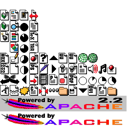

## Creating image maps

This code creates image maps from a collection of smaller images.

For this it needs to read and write images and for this it depends
on the Cocoa framework from Apple.   In particular it needs the objc bridge from
CCL (Clozure Common Lisp).

As a consequence this code only runs on CCL.

### Goodies

However not all is doom and gloom.  Besides packing images, it exports
some usefull functions to draw into bitmaps with Cocoa drawing operations

1. `make-image-rep` creates a bitmap image rep which holds bitmaps
   and can be drawn into by Cocoa drawing operations.
2. `load-image-rep` and `save-image-rep` converts back and forth
   between image representation and PNG files on disk.
3. `with-image-rep-context` is a macro which makes an image rep the
   target of the Cocoa drawing operations.

   So for example
   ```
	   (let ((image-rep (make-image-rep 100 100)))
          (with-image-rep-context image-rep
			  (#/drawInRect:withAttributes: #@"Hallo how are we doing?"
				  (ns:make-ns-rect 0.0 0.0 100.0 100.0) ccl:+null-ptr+))
		  (save-image-rep image-rep "/tmp/hallo.png"))
   ```
   will create the following image

   

### Actual Image Map Creation

This works by using either the function `image-rep-with-paked-images` or
`make-image-map`.  Here is an example of the later:

```
> (make-image-map (directory "/usr/share/httpd/icons/*.png")
	            "/tmp/sample-2.png" :size (list 260 260))
=>
((180.0D0 130.0D0 :|0| 20.0D0 22.0D0 #P"/usr/share/httpd/icons/world2.png")
 (160.0D0 130.0D0 :|0| 20.0D0 22.0D0 #P"/usr/share/httpd/icons/world1.png")
 (140.0D0 130.0D0 :|0| 20.0D0 22.0D0 #P"/usr/share/httpd/icons/uuencoded.png")
 ...)
 ```

And the resulting image is




